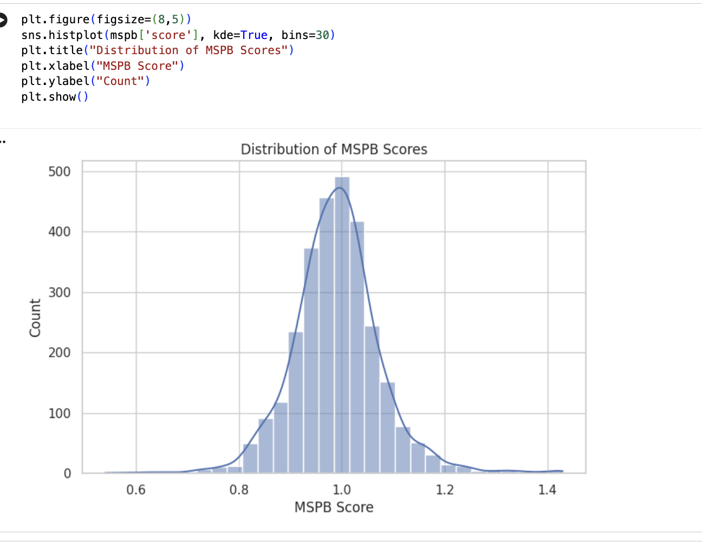
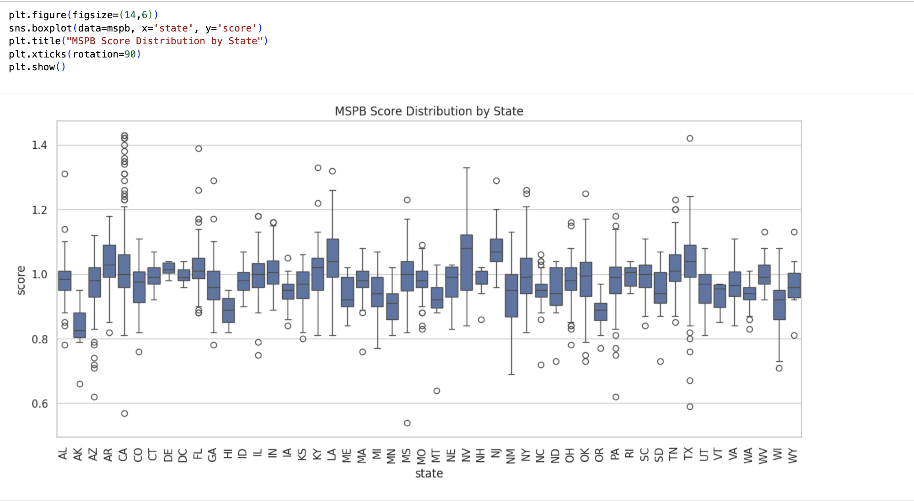
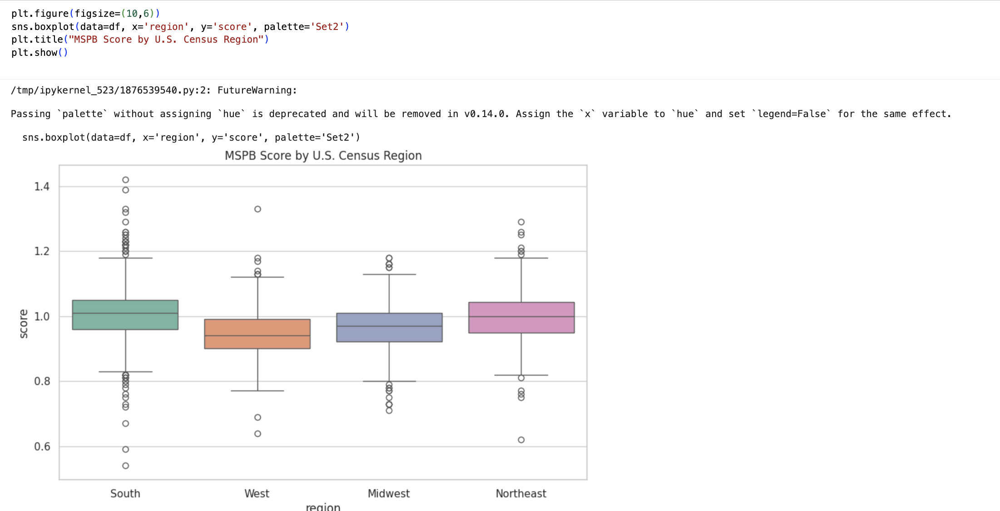

# Predicting High-Cost Hospitals Using AI and MSPB Data

AI-based prediction of high-cost hospitals using MSPB and CMS quality data, with a focus on interpretability and healthcare decision support.

---

## Overview

Medicare Spending Per Beneficiary (MSPB) is a key metric used by the Centers for Medicare and Medicaid Services (CMS) to evaluate how efficiently hospitals deliver care. MSPB captures all Medicare Part A and Part B spending during a patient's full episode of care, including the three days before admission, the inpatient stay, and the thirty days after discharge.

High MSPB values indicate higher than expected spending after adjusting for patient risk and geographic payment differences.

This project builds machine learning models to predict which U.S. hospitals are likely to have above-median MSPB spending, identifies the hospital characteristics most associated with high spending, and uses SHAP to produce interpretable outputs.

---

## Key Findings







1. Southern hospitals showed the highest median MSPB score (~1.01), with some facilities reaching 1.4x the national spending benchmark per episode of care.
2. Western hospitals were the most efficient on average (~0.94 median), although the region showed the widest variance. Efficiency is not evenly distributed.
3. Every region produced high-cost outliers. Overspending is not tied to geography. It shows up at the hospital level across the entire country.

---

## Data Sources

Both datasets are publicly available from CMS:

| Dataset | CMS Label |
|---|---|
| Medicare Spending Per Beneficiary - Hospital | Medicare Hospital Spending Per Patient |
| Hospital General Information | Hospital General Information |

The two datasets are merged on `facility_id`.

---

## Project Structure

| Section | Description |
|---|---|
| 1. Dependencies | Library imports and environment setup |
| 2. Load Data | Upload and read both CMS datasets |
| 3. Clean and Merge | Standardize columns, create binary target, merge datasets |
| 4. Exploratory Data Analysis | Score distributions, state and regional analysis, hospital characteristics, correlation heatmap, choropleth map |
| 5. Feature Engineering and Preprocessing | Feature selection, imputation, scaling |
| 6. Modeling | Logistic Regression, Decision Tree, Random Forest, XGBoost |
| 7. Evaluation | ROC curves and AUC comparison across all models |
| 8. Interpretability | SHAP summary and dependence plots for XGBoost |

---

## Target Variable

The binary target `high_cost` is defined as:

- `1` — Hospital MSPB score is above the national median
- `0` — Hospital MSPB score is at or below the national median

---

## Features

The model uses four hospital quality measure counts as predictors:

| Feature | Description |
|---|---|
| `count_of_facility_mort_measures` | Mortality measures reported |
| `count_of_facility_safety_measures` | Safety measures reported |
| `count_of_facility_readm_measures` | Readmission measures reported |
| `count_of_facility_te_measures` | Timeliness and efficiency measures reported |

The raw MSPB score is excluded from the feature set. Since the target variable is derived directly from the score, including it would create data leakage and produce misleading model performance.

---

## Models

| Model | Notes |
|---|---|
| Logistic Regression | Trained on scaled, imputed features |
| Decision Tree | Trained on imputed features |
| Random Forest | 300 estimators |
| XGBoost | 300 estimators, learning rate 0.05, max depth 4 |

All models are evaluated on accuracy, classification report, confusion matrix, and AUC.

---

## Interpretability

SHAP (SHapley Additive exPlanations) is applied to the XGBoost model to identify which features drive predictions at both the global and individual level.

---

## Requirements

```
pandas
numpy
matplotlib
seaborn
scikit-learn
xgboost
shap
geopandas
shapely
```

Install dependencies:

```bash
pip install shap xgboost geopandas shapely
```

---

## Notes

- Designed to run in Google Colab. The `files.upload()` calls handle data ingestion interactively.
- Causal inference exploration is planned for a future version.

---

## Author

Dylan Reid — [GitHub](https://github.com/dylan199512)
